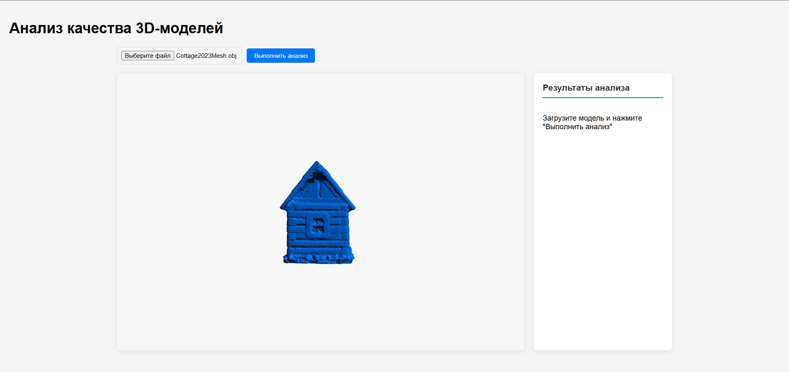
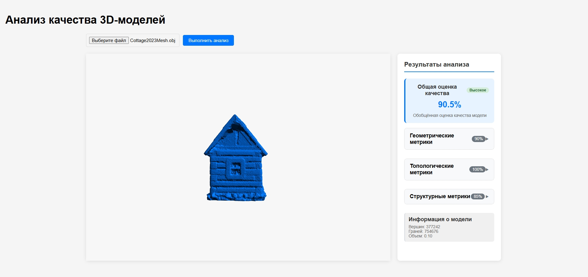
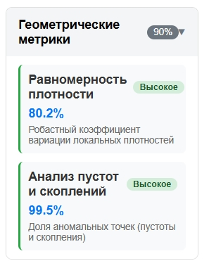
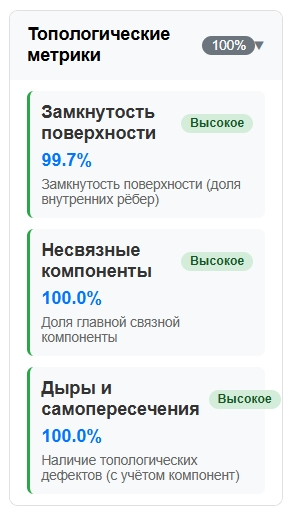
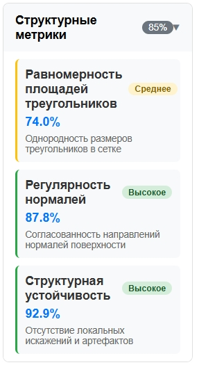
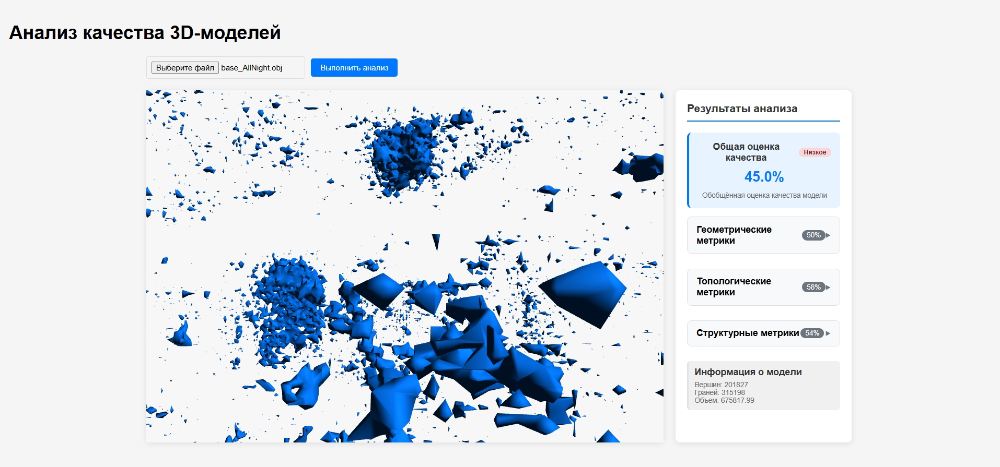

# 3D Model Quality Analyzer

Инструмент для автоматизированной оценки качества 3D-моделей, полученных методом фотограмметрии. 

##  О проекте

При фотограмметрической реконструкции 3D-моделей часто возникают дефекты: неравномерное распределение точек, разрывы поверхности, отверстия, самопересечения и другие артефакты. Данный инструмент позволяет **количественно оценить качество** модели по трём категориям метрик.

---

##  Возможности

- **Визуализация 3D-моделей** (форматы OBJ, STL, PLY)
- **Автоматический расчёт метрик качества**:
  - Геометрические (равномерность плотности, пустоты и скопления)
  - Топологические (замкнутость, связность, дыры)
  - Структурные (равномерность треугольников, гладкость нормалей)
- **Обобщенная оценка** качества модели
- **Удобный веб-интерфейс** с группировкой результатов

---


##  Технологии

| Компонент | Технология | Назначение |
|-----------|------------|------------|
| **Backend** | FastAPI | REST API для анализа моделей |
| | Trimesh | Загрузка и обработка 3D-моделей |
| | scikit-learn | Вычисление метрик (kNN) |
| **Frontend** | Three.js | 3D-визуализация моделей |
| | Vite | Сборка фронтенда |
| **Деплой** | Docker | Контейнеризация приложения |

---

##  Установка и запуск

### Требования

- Docker Desktop (Windows/Mac) или Docker + Docker Compose (Linux)
- Порт 3000 и 8000 должны быть свободны

### Запуск проекта

1. **Клонировать репозиторий**

```bash
git clone https://github.com/KristinaImbir/3d-quality-analyzer.git
cd 3d-quality-analyzer
```

2. **Запустить через Docker Compose**

```bash
docker-compose up --build
```

3. **Дождаться запуска**

```bash
frontend-1  |   ➜  Local:   http://localhost:3000/
backend-1   |   INFO:     Uvicorn running on http://0.0.0.0:8000
```

4. **Открыть в браузере**

```bash
Перейдите по адресу: http://localhost:3000
```

**Остановка**

```bash
docker-compose down
```

## Использование
- **Загрузить модель** — нажмите на "Выберети файл" и выберите файл (OBJ, STL, PLY)
- **Дождаться визуализации** — модель отобразится в 3D-просмотрщике
- **Выполнить анализ** — нажмите кнопку «Выполнить анализ»
- **Просмотреть результаты** — метрики сгруппированы по категориям с цветовой индикацией:
  - 🟢 Высокое качество (80-100%)
  - 🟡 Среднее качество (50-80%)
  - 🔴 Низкое качество (0-50%)

---

## Скриншоты
## 1. Главный экран с загруженной моделью


## 2. Результаты анализа


## 3. Расшифровка метрик
### Геометрические метрики


### Топологические метрики


### Структурные метрики


## 4. Пример плохой модели (Разрозненные фрагменты)

